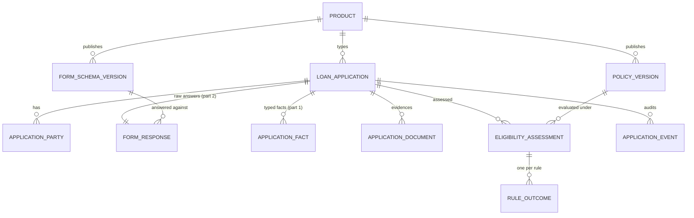
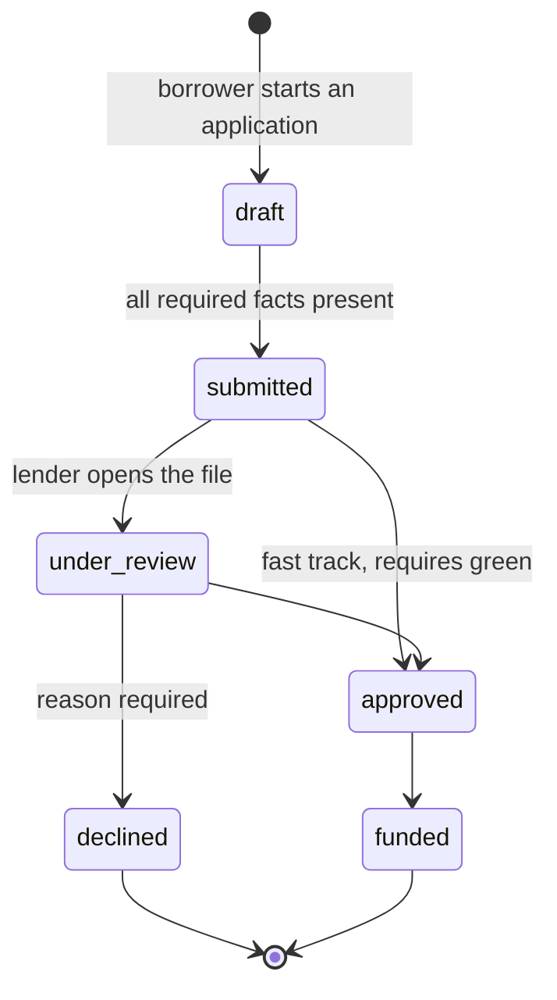
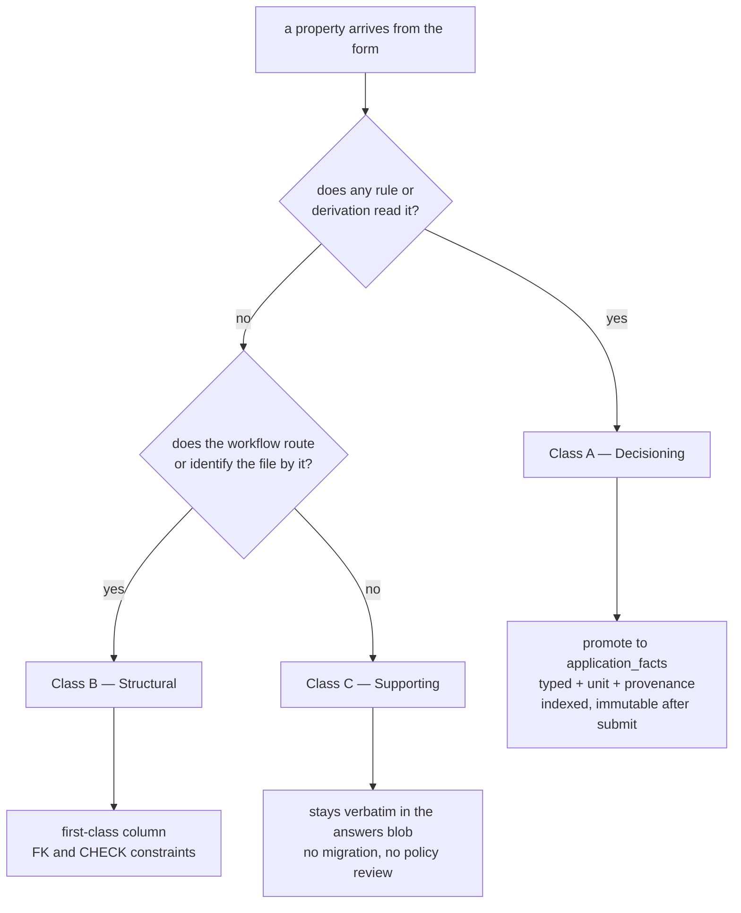
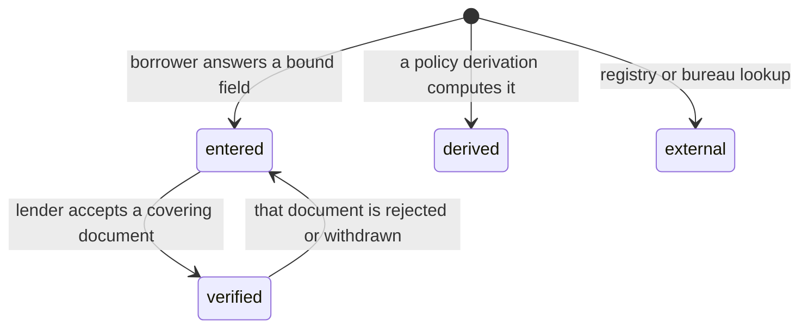
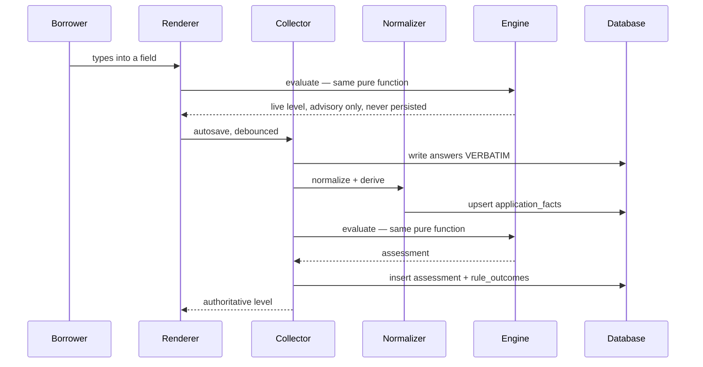
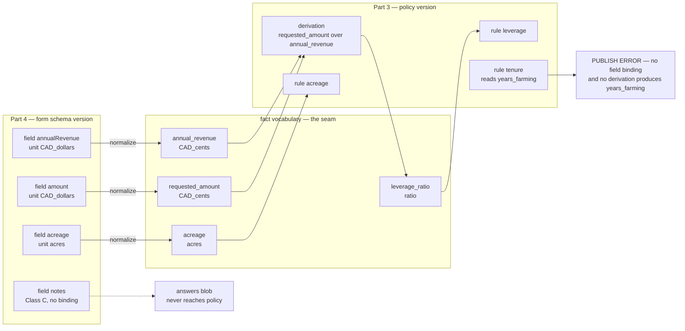

# Option 2 — loan application intake: data model and eligibility engine

**Declared answer: Option 2 — a dynamic loan application form with a rule-driven
eligibility engine.**

The one idea this design demonstrates:

> **The form, the answers, the policy and the file are four separate things with
> four separate lifecycles. A field's eligibility-relevance decides where it is
> stored.**

Everything below follows from that second sentence. It is the load-bearing
decision, and it is what the current code does not do.

---

## 0. Current state — what is already here, what is not

This repository ships Option 3 (the servicing portal). It contains a partial,
unfinished Option 2 underneath it. An honest starting point:

| Piece | State |
|---|---|
| `form_schemas` table (steps + rules as JSONB, one active) | **exists** |
| `evaluateEligibility` pure evaluator, shared client/server | **exists** |
| `validatePayload` schema validation, shared client/server | **exists** |
| `PATCH /requests/:id/draft` autosave, server-recomputes verdict | **exists** |
| `requests.payload` JSONB + `draft_step` | **exists** |
| `eligibility_green` guard gating a fast-track transition | **exists** |
| **The form renderer** (`borrower/application.page.ts`) | **3-line placeholder** |
| Schema authoring surface (the "maker") | **absent** |
| Documents, derived facts, fact provenance, policy versioning | **absent** |

Three defects in the existing half are load-bearing for this design, because each
one is a symptom of the four parts not being separated:

1. **Units are not part of the field contract.** `FormField.money` is declared in
   `form-schema.ts` and set on four seeded fields, and is then **read by nothing**.
   `mirroredAmount()` in `draft.ts` writes `Math.round(n)` straight into
   `requests.amount`, a column whose comment says integer cents. The credit-release
   path (`my-file.page.ts`) correctly routes through `parseMoneyToCents`. So the
   same column receives dollars from one path and cents from the other — a 100×
   disagreement in the lender queue. *No amount of care in the form fixes this;
   only a normalization boundary does.*

2. **Missing data reads as a pass.** `evaluateEligibility` does
   `if (value === null) continue` — a rule whose inputs are absent contributes no
   outcome, and `rollUp([])` returns `green`. Since `green` is exactly what the
   `eligibility_green` fast-track guard requires, *absence of evidence is currently
   evidence of eligibility*. A blank optional input cannot be allowed to mean "within
   policy".

3. **Policy is welded to the form.** Rules live in the same `form_schemas` row as
   the steps, and address raw payload keys directly (`amount / annualRevenue`).
   Retitling a field breaks a credit rule. Changing a credit threshold forces a new
   form version. Two things with genuinely different change cadences — a form
   changes for UX reasons, policy changes for credit reasons — are pinned to one
   version number.

---

## 1. What is "one application"?

An application is not a form submission. It is a **file**: a durable, auditable
claim that a named party asked for money on a named date, plus everything that was
asserted, derived, verified and decided about that claim.

The entity set:



Its lifecycle. This is the existing `TRANSITIONS` map unchanged — the design
below alters *what the guards read*, not which moves are legal:



The `submitted --> approved` edge is the sharp one: it is gated on an
eligibility verdict, so a rule change alters which transitions are legal. That
is the design working as intended, and it is why §0.2 is a real defect rather
than a cosmetic one.

And the flow between the four parts — note that it is **one-way**:

```
  PART 4 — FORM                    PART 2 — RAW              PART 1 — CORE
  ┌──────────────┐  renders   ┌──────────────────┐        ┌──────────────────┐
  │ schema       │──────────▶ │ form_responses   │        │ loan_application │
  │ version      │            │ answers (jsonb)  │        │ parties          │
  │ (maker →     │  collects  │ VERBATIM         │        │ documents        │
  │  renderer →  │◀────────── │ never normalized │        │ application_facts│
  │  collector)  │            └────────┬─────────┘        │  typed + united  │
  └──────────────┘                     │                  │  + provenance    │
                              normalize│(collector owns)  └────────┬─────────┘
                                       └──────────────────────────▶│
                                                                   │ facts only
  PART 3 — POLICY                                                  ▼
  ┌───────────────────────┐   pure, deterministic    ┌──────────────────────┐
  │ policy_version        │─────────────────────────▶│ eligibility_assess-  │
  │  derivations[]        │       evaluate()         │ ment + rule_outcomes │
  │  rules[]              │                          │ (immutable snapshot) │
  └───────────────────────┘                          └──────────────────────┘
```

The engine **never reads raw answers**. It reads facts. That single constraint is
what decouples the form from the policy.

---

## 2. The storage rule

> **A property's eligibility-relevance determines its storage class.**

Three classes. Every property in the system belongs to exactly one.

| Class | Definition | Storage | Why |
|---|---|---|---|
| **A — Decisioning** | Feeds a rule, directly or through a derivation | Promoted out of the blob into `application_facts`: typed, unit-tagged, provenance-stamped, indexed, immutable after submit | A decision was made on it. You must be able to reproduce, explain and defend that decision years later, and query the portfolio by it |
| **B — Structural** | Identifies or routes the file — party, product, requested amount, currency, status | First-class columns on the aggregate, with FKs and CHECK constraints | The workflow itself reads these. They need referential integrity, not flexibility |
| **C — Supporting** | Narrative and context. Read by humans, gates nothing | Stays verbatim in the raw answers blob | Cheap to add, cheap to change, no migration, no policy risk |

The decision procedure, applied to every property once:



A property can be both A and B — `amount` is the requested amount that routes
the file *and* the numerator of the leverage rule, so it lands in a column and
is mirrored as a fact. Nothing is ever both A and C: the moment a rule reads a
property, it stops being narrative.

**The promotion boundary is one-way and single-writer.** Raw answers are written
by the collector. Facts are written by the normalizer, which the collector owns.
Nothing else writes facts — not the lender screen, not an admin tool, not a
backfill script without a recorded provenance row.

### Raw and fact are not duplicates

They are two different claims about the same answer, and both are needed:

- **Raw** — *"the borrower typed `250,000` into the field labelled 'Credit limit
  requested' on schema v1."* This is evidence. It is what you show when someone
  disputes what was asked or what they said.
- **Fact** — *"`requested_amount = 25000000`, unit `CAD_cents`, source `entered`,
  derived from field `amount` of schema v1 by normalizer v3 at 2026-08-12T09:14Z."*
  This is what the engine decided on.

Keeping only the raw blob is exactly the bug in §0.1: there is no place for the
unit to live, so it lives in a comment and gets ignored. Keeping only the fact
loses the ability to prove what was asked.

### Classifying the current seeded form

Applying the rule to the fields that exist today:

| Field | Class | Reasoning | Lands in |
|---|---|---|---|
| `fullName` | **B** Structural | Identifies the party | `application_parties.legal_name` |
| `email` | **B** Structural | Contact + dedupe key | `application_parties.email` |
| `phone` | **C** Supporting | Contact only, gates nothing | raw blob |
| `farmName` | **B** Structural | Names the operation being financed | `loan_applications.operation_name` |
| `acreage` | **A** Decisioning | Rule `acreage` (fail <50, warn <100) | fact, unit `acres` |
| `yearsOps` | **A** Decisioning | Rule `tenure` (fail <1, warn <5) | fact, unit `years` |
| `cropType` | **A** Decisioning *(conditional)* | Selects **which rules apply** — dairy and grain do not share a policy | fact, enum |
| `annualRevenue` | **A** Decisioning | Denominator of the leverage rule | fact, unit `CAD_cents`, `requires: verified` above threshold |
| `existingDebt` | **A** Decisioning | Debt service. *Currently collected and never used by any rule — a fact with no rule is fine; a rule with no fact is a publish-time error* | fact, unit `CAD_cents` |
| `amount` | **A + B** | Both the requested amount (routes the file) and the leverage numerator | column `requested_amount_cents` **and** mirrored fact |
| `purpose` | **A** Decisioning *(conditional)* | Product routing; equipment vs operating carry different policy | fact, enum |
| `notes` | **C** Supporting | Free narrative | raw blob |

Plus facts that are **not** form fields at all — which is the point of separating
facts from the form:

| Fact | Source kind | Produced by |
|---|---|---|
| `leverage_ratio` | `derived` | Policy derivation `requested_amount / annual_revenue` |
| `debt_to_revenue` | `derived` | Policy derivation `existing_debt / annual_revenue` |
| `revenue_verified` | `verified` | Lender accepting a financial-statement document |
| `land_title_confirmed` | `external` | Registry lookup (future) |

---

## 3. Part 1 — Core application data (the file)

### `loan_applications` — the aggregate root

| Prop | Type | Class | Notes |
|---|---|---|---|
| `id` | uuid | B | |
| `reference` | text | B | Human-quotable, e.g. `APP-2026-00417`. Support asks for this, not a uuid |
| `product_id` | uuid | B | Which product's form and policy apply |
| `primary_party_id` | uuid | B | |
| `schema_version_id` | uuid | B | **Pinned at draft start.** The form must not mutate under a borrower mid-fill |
| `requested_amount_cents` | bigint | A+B | Canonical. Cents, always |
| `currency` | text | B | |
| `operation_name` | text | B | |
| `status` | enum | B | `draft → submitted → under_review → approved/declined → funded` |
| `current_assessment_id` | uuid | B | Denormalized pointer to the latest assessment, for the queue |
| `submitted_at` / `decided_at` | timestamptz | B | |
| `version` | int | B | Optimistic lock. Reuses the existing concurrency approach |
| `created_at` / `updated_at` | timestamptz | B | |

### `application_parties`

`id`, `application_id`, `profile_id?`, `role` (`primary` / `co_applicant` /
`guarantor`), `legal_name`, `email`, `phone`. Modelled as a table from day one
because agricultural lending is rarely single-party, and retrofitting a
co-applicant onto a flat column set is a migration through every screen.

### `application_facts` — the promoted, decisionable values

This is the table that makes the design work.

| Prop | Type | Notes |
|---|---|---|
| `id` | uuid | |
| `application_id` | uuid | |
| `fact_key` | text | Stable policy vocabulary — `annual_revenue`, **not** the form's `annualRevenue`. This indirection is the decoupling |
| `value_numeric` | numeric | |
| `value_text` | text | |
| `value_bool` | boolean | |
| `value_date` | date | |
| `unit` | text | `CAD_cents`, `acres`, `years`, `ratio`, `enum`. **Not nullable for numeric facts** |
| `source_kind` | enum | `entered` / `derived` / `verified` / `external` |
| `source_field_key` | text | Which form field produced it, null when derived |
| `source_schema_version_id` | uuid | |
| `source_document_id` | uuid | Set when `verified` |
| `normalizer_version` | int | So a normalization bug is identifiable and re-runnable |
| `recorded_at` | timestamptz | |

Constraints: unique on `(application_id, fact_key)`; a CHECK that exactly one
`value_*` column is non-null; a CHECK that `unit is not null` when
`value_numeric is not null`.

`source_kind` is not decoration. It lets policy demand provenance — *"annual
revenue must be `verified`, not `entered`, when the requested amount exceeds
$500k"* — which is an ordinary lending requirement that is impossible to express
if a fact is just a number in a blob.

### `application_documents`

`id`, `application_id`, `kind`, `storage_key`, `status`
(`pending`/`accepted`/`rejected`), `verifies_fact_keys text[]`, `uploaded_by`,
`reviewed_by`, `reviewed_at`. Accepting a document is what promotes the facts it
covers from `entered` to `verified`, which can move a rule from amber to green —
so documents are part of the eligibility model, not an attachment sidebar.

How a fact's `source_kind` moves:



A rule carrying `requiresProvenance: "verified"` returns `insufficient_data`
while the fact sits at `entered` — so uploading and having a document accepted
is what closes the gap, and the reason shown to the borrower is "we still need
your financial statement" rather than a decline.

### `eligibility_assessments` and `rule_outcomes`

An assessment is an **immutable snapshot**, never an update-in-place:

| Prop | Notes |
|---|---|
| `id`, `application_id` | |
| `policy_version_id` | Which policy produced this verdict |
| `facts_digest` | Hash of the fact set evaluated. Two assessments with the same digest and policy must agree — cheap self-check, and it detects a fact mutated behind the engine's back |
| `level` | `green` / `amber` / `red` / **`incomplete`** |
| `evaluated_at`, `triggered_by` | `autosave` / `submit` / `document_accepted` / `policy_republished` / `manual` |

`rule_outcomes`, one row per rule per assessment: `rule_key`, `status`
(`pass`/`warn`/`fail`/**`insufficient_data`**), `observed_value`, `observed_unit`,
`threshold_applied`, `message`.

Storing per-rule outcomes as **rows, not JSONB**, is deliberate. It turns
portfolio questions into ordinary SQL — *"how many files failed the acreage rule
last quarter"*, *"which rule most often blocks fast track"* — instead of JSONB
scans. Those questions are the entire reason a lender wants a rule engine rather
than a checklist.

### `application_events`

Append-only audit, unchanged in spirit from the existing `request_events`:
`from_status`, `to_status`, `actor_id`, `actor_role`, `note`, `created_at`.
History is read from here, never reconstructed from current status.

---

## 4. Part 2 — Raw application data from the borrower

One table, deliberately dumb.

### `form_responses`

| Prop | Notes |
|---|---|
| `id`, `application_id` | |
| `schema_version_id` | What they were actually shown |
| `answers` | jsonb, **verbatim**. Keyed by form field key. Never normalized, never unit-converted, never renamed |
| `step_reached` | Resume point |
| `autosave_seq` | Monotonic. Rejects an out-of-order autosave from a stale tab |
| `submitted_at` | Null while draft |
| `client_meta` | User agent, locale, timezone — matters when a decimal separator is disputed |

Rules for this table:

- **Verbatim.** If the borrower typed `250,000`, that string is what is stored.
  Every interpretation of it belongs downstream in the normalizer.
- **Frozen at submit.** After `submitted_at` is set the row is immutable. A
  correction creates a new revision, it does not overwrite evidence.
- **The engine may not read it.** Enforced by the type signature: `evaluate()`
  takes a `FactSet`, and a `FormResponse` is not one.
- **Adding a Class C field costs nothing.** No migration, no policy review, no
  fact key. That is the payoff for keeping the blob.

Optional `form_response_revisions` (append-only prior versions) if an audit
requirement demands keystroke-level history; not needed for the assignment.

---

## 5. Part 3 — Eligibility rules and engine

### Policy is versioned separately from the form

```
policy_versions
  id, product_id, version, status (draft|active|retired)
  effective_from, effective_to
  derivations  jsonb   -- facts computed from facts
  rules        jsonb   -- thresholds over facts
  published_by, published_at
```

A policy version and a form schema version are **independently publishable**.
Raising a leverage threshold is a policy release. Retitling a field is a form
release. Neither forces the other.

### Derivations produce facts, they do not live inside rules

The current design computes `amount / annualRevenue` *inside* a rule, so the
ratio exists only for the instant the rule runs. Promoting derivations to
first-class fact producers means the ratio is stored, queryable and explainable:

```jsonc
"derivations": [
  { "factKey": "leverage_ratio",
    "unit": "ratio",
    "expr": "requested_amount / annual_revenue",
    "requires": ["requested_amount", "annual_revenue"] }
]
```

Derived facts are written with `source_kind = 'derived'`. Rules then only ever
read facts — one input shape, no special cases.

### The rule shape

```jsonc
{
  "key": "leverage",
  "label": "Requested vs revenue",
  "category": "capacity",              // capacity | collateral | tenure | conditions
  "appliesWhen": { "fact": "crop_type", "in": ["Grain", "Mixed"] },
  "input": "leverage_ratio",
  "expectUnit": "ratio",               // engine asserts; mismatch is an error, not a guess
  "requiresProvenance": "entered",     // or "verified"
  "thresholds": { "warnAbove": 2, "failAbove": 3 },
  "onMissing": "insufficient_data",    // EXPLICIT. never silently skip
  "severity": "hard",                  // hard fail → red; soft fail → amber ceiling
  "explain": "{observed} of revenue against a {threshold} maximum"
}
```

Four changes from the current `EligibilityRule`, each fixing a specific defect:

| Change | Fixes |
|---|---|
| `input` names a **fact key**, not a payload key | Renaming a form field can no longer break a credit rule (§0.3) |
| `expectUnit` asserted by the engine | The dollars/cents 100× disagreement (§0.1) becomes a loud error at publish time |
| `onMissing` explicit, defaulting to `insufficient_data` | "Blank rolls up to green" (§0.2) |
| `appliesWhen` predicate | Dairy and grain stop sharing one policy, without forking the form |

### Four levels, not three

| Rule status | Meaning | Roll-up contribution |
|---|---|---|
| `pass` | Within policy | green |
| `warn` | Outside preference | amber |
| `fail` | Outside policy | red |
| `insufficient_data` | Inputs absent or provenance too weak | **`incomplete`** |

```
  worst level present wins, in this order:

    red         ▲   a hard threshold is breached
                │
    incomplete  │   we do not know yet          ◀── NEW. and it outranks amber.
                │
    amber       │   known, and outside preference
                │
    green       │   known, and within policy

  Today there is no `incomplete`, so a rule with absent inputs contributes
  no outcome at all, an empty outcome list rolls up to `green` — and `green`
  is exactly what the fast-track guard requires.
```

Roll-up order: `red` > `incomplete` > `amber` > `green`. `incomplete` outranks
`amber` because *not knowing* must never present as milder than *knowing
something mildly bad* — that inversion is how a blank form gets fast-tracked.

The `eligibility_green` fast-track guard then keeps working unchanged, and
becomes correct: an empty file is `incomplete`, not `green`.

### Engine contract

```ts
evaluate(facts: FactSet, policy: PolicyVersion, at: ISOString): Assessment
```

**Pure, deterministic, total.** No I/O, no clock, no randomness — `at` is passed
in, exactly as `evaluateEligibility` already does. The same function runs in two
places:

- **Browser** — on every keystroke, for live feedback. Never persisted, never
  trusted.
- **Server** — at autosave, at submit, when a document is accepted, and when a
  policy is republished. Only the server's verdict is written.



The borrower's browser and the server run **the same function over different
inputs** — the browser over what has been typed, the server over normalized
facts. Only the server's verdict is written, so a lender never acts on a level
computed in somebody's browser.

This half already exists in `packages/contracts/src/eligibility.ts` and the
`draft.ts` handler; it is the part of the current code most worth keeping.

### When the engine runs, and against which policy

- **Schema version is pinned at draft start** — the form must not change under
  someone mid-fill.
- **Policy version is resolved at each evaluation** and recorded on the
  assessment — so an undecided file always reflects current credit policy, and
  every assessment is self-describing.

```
 time ─────────────────────────────────────────────────────────────────────▶

 form schema    ┌ v1 PINNED at draft start ───────────────────────────────┐
                │ the form cannot change under a borrower mid-fill        │
                └────────────────────────────────────────────────────────-┘

 policy         ──── v3 ──────────────┬──── v4 published ─────────────────
                                      │
 application    draft ── autosave ── autosave ── submit ──── decision
                          │            │           │            │
 assessments             A1            A2          A3           A4
                        (v3)          (v4)        (v4)         (v4)
                                       ▲
                                       └── the level can change HERE without
                                           the borrower touching anything.
                                           An application_event records it,
                                           so it is visible, not mysterious.
```

The tradeoff is real and stated: a borrower can watch their verdict change
without touching the form, because policy moved. The alternative — pinning policy
at draft start — means a file decided next month is decided under last month's
credit policy, which is worse. Mitigation is an `application_event` row whenever
a republish changes a live file's level, so the change is visible rather than
mysterious.

---

## 6. Part 4 — The application form: maker, renderer, collector

One schema definition, three consumers with sharply different jobs.

### 6.1 Maker — authoring and the publish gate

Authors a `form_schema_versions` row: steps, fields, and — critically — each
field's **`factKey` binding** and **`unit`**.

```jsonc
{ "key": "annualRevenue", "type": "number", "label": "Annual revenue",
  "required": true, "min": 0,
  "unit": "CAD_dollars",          // what the borrower types
  "factKey": "annual_revenue",    // what policy reads
  "factUnit": "CAD_cents" }       // what gets stored — normalizer converts
```

The maker's real value is the **publish-time coherence check** between Part 4 and
Part 3. Publishing a schema/policy pair must fail loudly when:

1. A rule reads a `factKey` that no field binding and no derivation produces —
   *a policy that can never be satisfied by the form in front of the borrower.*
2. A derivation references a fact key nothing produces, or derivations form a cycle.
3. A numeric field declares no `unit`, or a field's `factUnit` has no registered
   conversion from its `unit`. **This is the check that makes §0.1 impossible.**
4. Two fields bind the same `factKey`, or field keys collide.
5. A `visibleWhen` or `appliesWhen` predicate references an unknown key.
6. A rule sets `requiresProvenance: "verified"` but no document kind declares that
   fact in `verifies_fact_keys` — an unreachable green.

The graph the check walks. Form fields bind to a **stable fact vocabulary**;
policy addresses only that vocabulary; the two sides never touch each other
directly:



Read left to right, the seam in the middle is the whole design: a retitle or
rekey on the left cannot reach the right, because only `factKey` crosses. Read
the `R3` branch and you get check 1 — the rule reads a fact vocabulary entry
nothing produces, which today is silent and under this design is a publish
failure.

Check 1 is the one that earns the whole indirection. Today, a mistyped key in a
rule silently produces a rule that never fires, and a never-firing rule reads as
a pass.

A fact with no rule is fine (`existing_debt` today). A rule with no fact is a
publish error.

### 6.2 Renderer — pure projection of schema + answers

`(schemaVersion, answers) → controls`. Angular, signals, reactive forms built at
runtime. Derives its validators from the schema so client and server validation
cannot drift — `validatePayload` already exists and is shared. Handles
`visibleWhen`. Displays the assessment the engine returns, and shows *per-rule*
outcomes, including `insufficient_data` as **"we still need X"** rather than as a
failure.

Knows nothing about policy beyond rendering what the engine hands back. This is
the file that is currently a 3-line placeholder and is the largest build item.

### 6.3 Collector — the single write boundary

Owns autosave, submit, and — the part that does not exist today — **normalization**.

```
answers (verbatim)
   │
   ├── validate            partial on autosave, full at submit  [exists]
   │
   ├── persist raw         form_responses.answers               [exists, as requests.payload]
   │
   ├── NORMALIZE           per field: unit conversion, type coercion,
   │                       enum canonicalization → facts         ← MISSING TODAY
   │
   ├── DERIVE              run policy derivations → derived facts ← MISSING TODAY
   │
   └── ASSESS              evaluate(facts, policy) → assessment + rule_outcomes
```

The normalizer is the only place `CAD_dollars → CAD_cents` happens, and it happens
because the field **declares** its unit rather than because a handler remembered
to call `parseMoneyToCents`. It carries a `normalizer_version` stamped onto every
fact, so a conversion bug is identifiable and re-runnable rather than silently
baked into history.

`mirroredAmount()` — the current hand-rolled promotion of one field — is the
normalizer in embryo. This design generalizes it and deletes the special case.

---

## 7. Build plan

| # | Step | Deliverable |
|---|---|---|
| 1 | Split `form_schemas` into `form_schema_versions` + `policy_versions` | Migration; existing seed splits into a v1 of each |
| 2 | Add `fact_key` / `unit` / `factUnit` to `FormField`; add `factKey` to rules | `packages/contracts` types |
| 3 | `application_facts` table + `Normalizer` with a unit registry | The §0.1 fix |
| 4 | Derivations as fact producers; rules read facts only | `policy_versions.derivations` |
| 5 | `insufficient_data` + `incomplete`; `onMissing` explicit | The §0.2 fix. Extend `rollUp` |
| 6 | `eligibility_assessments` + `rule_outcomes` tables; snapshot on write | Replaces `requests.eligibility` JSONB |
| 7 | Publish-time coherence check | The §0.3 fix. Pure function, heavily unit-tested |
| 8 | **The renderer** — replace the placeholder page | Largest UI item |
| 9 | Documents + `verified` provenance | Optional; the provenance model is already in place for it |

Steps 1–7 are contract and data work, testable without any UI, and are where the
design earns its keep. Step 8 is the visible deliverable.

The existing state machine, guards, event log, optimistic locking and RLS carry
over unchanged — this design changes *what the guards read*, not how transitions
work.

---

## 8. What problem does this design resolve?

1. **The form and credit policy stop holding each other hostage.** They version
   independently. A UX retitle is not a credit release; a threshold change is not
   a form release. This is the primary win and it is structural, not stylistic.

2. **Units become impossible to get wrong.** Today `field.money` is decoration and
   two code paths disagree about a `bigint` by 100×. Under this design the unit is
   declared on the field, converted at exactly one boundary, stamped onto the fact,
   asserted by the engine, and checked at publish time. Four independent chances to
   catch it, versus zero.

3. **"We don't know" stops meaning "approved".** A blank input currently rolls up
   to `green`, which is the exact value the fast-track guard requires. Adding
   `insufficient_data`/`incomplete` and ranking it above `amber` closes a path
   where an under-filled file could be approved without review.

4. **Verdicts become reproducible and explainable.** `policy_version_id` +
   `facts_digest` + per-rule outcomes means *"why was this declined in August"*
   is answerable in SQL a year later, with the thresholds that actually applied.
   A stored `level` alone cannot answer it.

5. **Eligibility becomes queryable across the portfolio.** Rule outcomes as rows
   turn "which rule blocks fast track most often" and "how many files fail acreage"
   into ordinary queries. That reporting capability is the actual business reason
   to build a rule engine instead of an `if` statement.

6. **Renaming a form field can no longer break a credit rule**, because rules
   address a stable fact vocabulary and the binding is validated at publish.

7. **Provenance becomes expressible.** "Revenue must be verified above $500k" is a
   normal lending requirement and is simply unrepresentable when a fact is a bare
   number in a blob.

8. **Adding a supporting question stays free.** Class C fields need no migration
   and no policy review — the flexibility of the JSONB blob is kept exactly where
   it is harmless, and removed exactly where it is dangerous.

---

## 9. Limits of this design

Stated plainly, including the ones that would bite first.

**Structural**

1. **The same answer exists twice** — verbatim in `form_responses.answers` and
   normalized in `application_facts`. They cannot disagree only as long as the
   one-way flow is honoured. The moment any other code path writes a fact
   directly, the invariant is gone and nothing in the schema will catch it. This
   is enforced by convention and code review, not by the database.

2. **EAV trades DB-level typing for flexibility.** `application_facts` cannot
   express "annual revenue must be non-negative" as a column CHECK the way
   `loans.balance` does. Type and unit correctness moves into the normalizer and
   its tests. That is a real downgrade in database-enforced integrity, accepted in
   exchange for adding a decisioning field without a migration.

3. **A new rule over a never-collected fact yields `insufficient_data` for every
   existing file.** Correct, but operationally noisy — it needs either a backfill
   or an `effective_from` policy that only applies the rule to files submitted
   after it. Backfilling facts nobody ever asked for is impossible by definition;
   this is a genuine cost of correctness.

4. **Pinning the schema but not the policy makes verdicts move under live files.**
   The event-log mitigation makes it visible, not painless. The opposite choice is
   worse. There is no third option that is both stable and current.

**Expressiveness**

5. **The rule language has a hard ceiling.** Thresholds, ratios and enum
   predicates. It cannot express: aggregation across a borrower's other
   applications or loans (total exposure), time series (revenue trend over three
   years), inter-party logic (guarantor strength offsetting weak tenure), scorecards
   with weights, or anything probabilistic. Those need a real DSL or code-defined
   rules, and the honest answer is that rules-as-data is right up to that line and
   wrong past it.

6. **Conditional rules are hard to reason about in aggregate.** `appliesWhen`
   makes policy expressive and simultaneously makes "which rules apply to a dairy
   file requesting $2M for land" a question nobody can answer by reading the JSON.
   That needs a policy simulator, which this design does not include.

7. **A level is not a term sheet.** The engine says green/amber/red/incomplete. It
   cannot say "approved at $180k instead of $250k", or "approved subject to
   security". Partial approval and counter-offer are outside this model and would
   need decisioning entities of their own.

**Operational**

8. **Publishing a policy version changes outcomes for every undecided file, with
   no four-eyes control in this design.** For a real lender that is a governance
   gap: policy publish should require maker-checker approval. Deliberately out of
   scope here, and it should not stay out of scope in production.

9. **Coupling eligibility to transition legality is powerful and sharp.** The
   `eligibility_green` guard means editing a JSONB threshold changes which state
   transitions are legal. That is the design working as intended, and it is also
   one careless edit away from either blocking every file or fast-tracking every
   file. It argues for policy publish being a gated, reviewed, reversible act.

10. **Write amplification on autosave.** Every keystroke-debounced save
    re-normalizes, re-derives and re-assesses server-side. Fine at assignment
    scale; at real volume it needs the assessment to be conditional on the fact
    digest actually changing.

**Out of scope entirely**

11. Identity verification, credit bureau pulls, AML/KYC, fraud signals, document
    OCR extraction, multi-currency/FX, and decision explainability requirements
    under lending regulation beyond the audit trail described here.

---

## 10. Open questions

1. Is a fact ever **corrected** after submit — a typo in acreage — and if so, does
   that create a new fact revision plus a new assessment, or reopen the file?
   (Recommendation: new revision, new assessment, event-logged. Never overwrite.)
2. Should `incomplete` be visible to the lender queue as its own filter, or fold
   into amber for triage? (Recommendation: its own filter — the operational
   response is "chase the borrower", not "review".)
3. Do co-applicant facts roll up into one fact set, or does each party carry its
   own? Aggregation policy (sum revenue? max tenure?) is a credit decision, not a
   technical one, and needs a lender's answer before it can be modelled.
